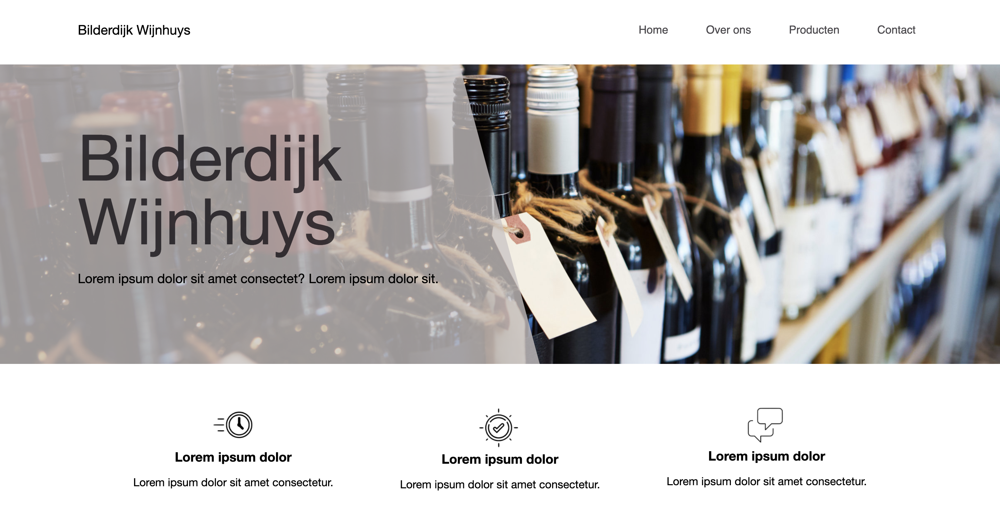
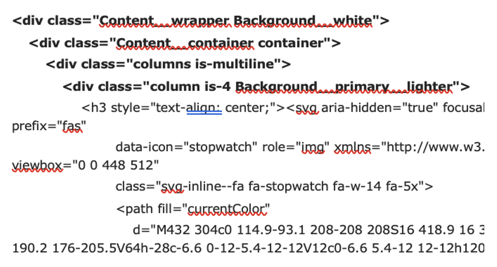

# Procesverslag

**Auteur: 
Gloria Kwako 👾

### De opdracht:
Een nieuwe lay-out maken voor van hun onepage websites. Eventueel zelf
programmeren.

## Breakdownschets (onderdelen)

## Voortgang 1 (week 2)

Stand van zaken

Week 2:

Deze week ben ik begonnen aan de one page template, hier voor heb ik een breakdown schets gemaakt met alle elementen die gebruikt zullen worden tijden het coderen. Voordat ik begon waren er al een paar elementen die een probleem zouden vormen, denk aan de schuine vorm bij het begin en de parallax.

Maar het is mij wel gelukt om de schuine vorm op te lossen, alleen moet de parallax nog opgelost worden. Verder heb ik een grotendeels wel af kunnen krijgen, de volgende stap is het cleanen en punten op de I. 

## Voortgang 1 (week 3)

Stand van zaken

Deze week ben ik begonnen met het opschonen van de code en de structuur van Bulma aan het overnemen, dit was niet zo makkelijk dan gedacht. Hier liep ik erg mee vast omdat al mijn eigen structuur had gebruikt moest ik die veranderen zodat ik het structuur van Bulma kon overnemen. 

Dankzij Jeroen was het mij gelukt om een grote deel van de structuur over te nemen. Wel heeft mijn code nu dringend grote schoonmaak nodig. 

## Voortgang 1 (week 4)

Stand van zaken

......

