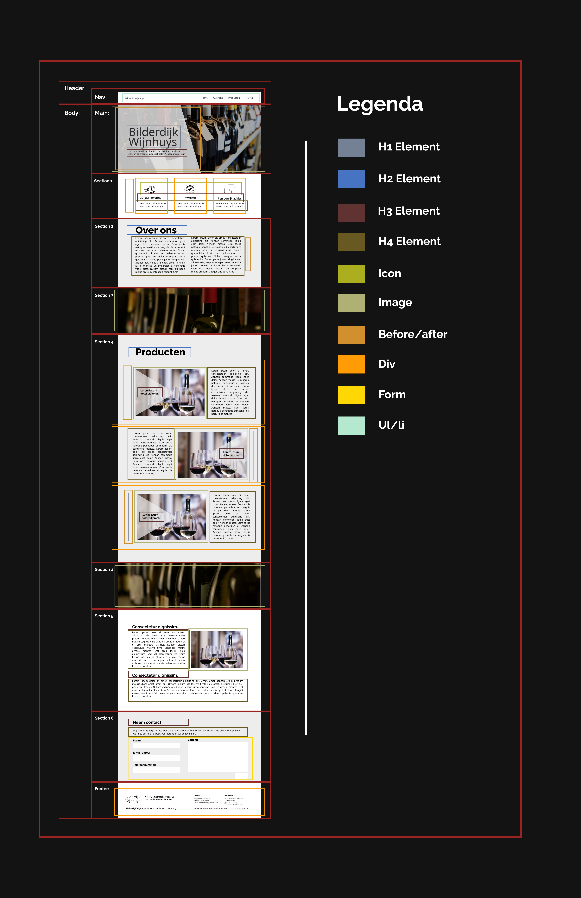

# Procesverslag

**Auteur: 
Gloria Kwako 👾

### De opdracht:
Een nieuwe lay-out maken voor van hun onepage websites. Eventueel zelf
programmeren.

## Breakdownschets (onderdelen)

## Voortgang 1 (week 2)

Stand van zaken

......

## Voortgang 1 (week 3)

Stand van zaken

......

## Voortgang 1 (week 4)

Stand van zaken

......

